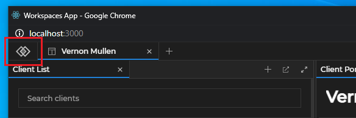
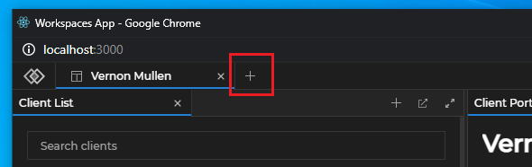
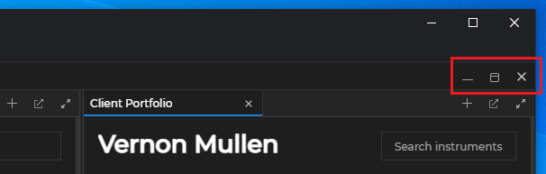
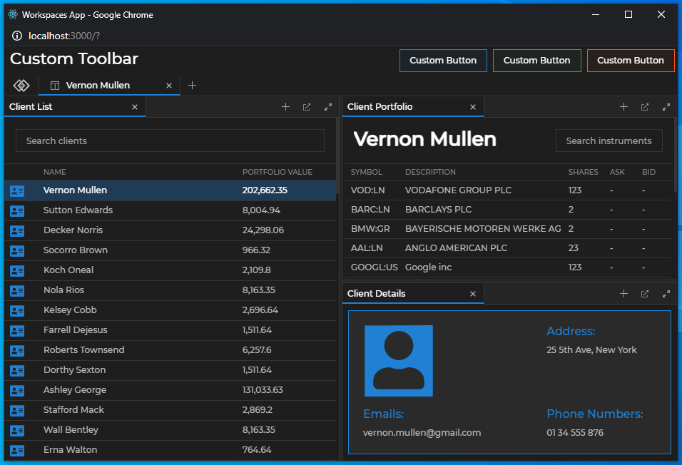
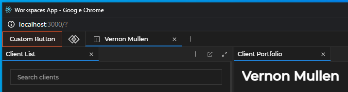
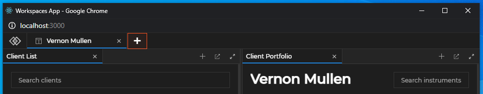
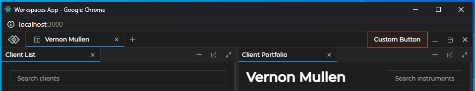
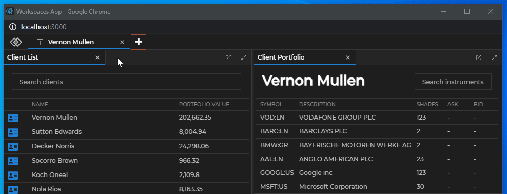
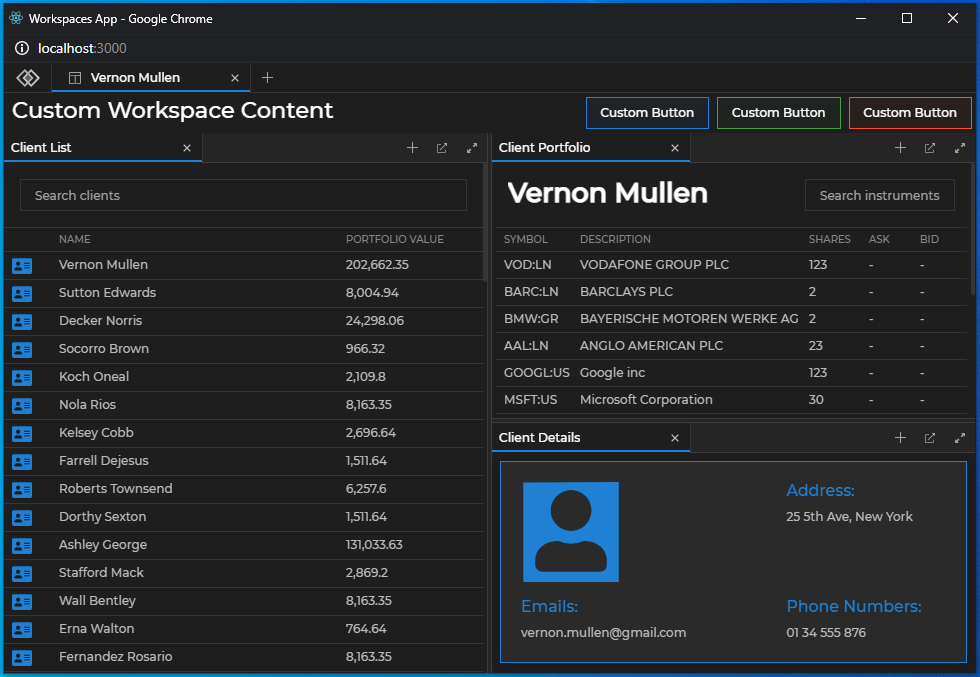

## Workspaces App

The Workspaces App (or [Frame](../overview/index.html#workspaces_concepts-frame)) is mandatory for using any Workspaces functionality. For [**Glue42 Core**](https://glue42.com/core/) projects you have to create your own Workspaces App using the [@glue42/workspaces-ui-react](https://www.npmjs.com/package/@glue42/workspaces-ui-react) library which provides all functionalities necessary for building a Workspaces App as a single React component - `<Workspaces />`. The `<Workspaces />` component provides extensibility points for passing custom components to it and can also be wrapped in other components (see [Workspaces Component](#workspaces_component)). The library enables you to use custom system popups, create your own popups from HTML elements (see [Custom Popups](#custom_popups)) and compose the content of a Workspace (see [Composing Workspace Content](#composing_workspace_content)).

Hot module reloading is supported, but keep in mind that each refresh closes all apps and Workspaces in the Frame.

*Use the [Workspaces App template](https://github.com/Glue42/templates/tree/master/workspaces-react) provided in the [**Glue42 Core**](https://glue42.com/core/) GitHub repo as a startup skeleton to create and customize your own Workspaces App.*

## Header Area Zones

It is possible to add custom components in the Workspaces App header area in the following zones:

- Logo zone
- Add Workspace zone
- System Buttons zone

The Logo zone is located at the leftmost part of the header area, to the left of the Workspace tabs, and hosts the `<GlueLogo />` component. By default, it renders the Glue42 logo:



The Add Workspace zone is located between the Workspace tabs and the move area and hosts the `<AddWorkspaceButton />` component. By default, it renders the "+" button that opens the Add Workspace popup:



The System Buttons zone is located at the rightmost part of the header area, after the move area, and hosts the `<MinimizeFrameButton />`, `<MaximizeFrameButton />` and `<CloseFrameButton />` components. By default, they render the Minimize, Maximize and Close buttons:



## Using the Components

All default components can be reused and composed with custom code. If usage of such component has been detected, its default behavior will be applied. For instance, if you use the `<AddWorkspaceButton />` component, a popup will automatically appear when the button is clicked, without the need of custom code to induce this behavior. If you pass the same component more than once, an error will be thrown.

To remove a component and make the respective zone empty, pass a `<Fragment />` component.

There are several prerequisites when creating a custom Workspaces App:

- The `<Workspaces />` component accepts the size of its container. If it is nested in another component, the parent component must have its `height` style property set to `100%` in order for the `<Workspaces />` component to be visible.
- The `@glue42/workspaces-ui-react` library depends on the `glue` object returned by the initialized Glue42 Web library. If you have used the [Glue42 React Hooks](../../../../developers/core-concepts/web-client/react/index.html) wrapper to obtain the `glue` object, or if you have attached the `glue` object to the global `window` object, it will be automatically passed to the `<Workspaces />` component as a prop. Otherwise, you must pass it manually as a prop to the `<Workspaces />` component.
- The CSS files must be added manually (see [Styles](#styles)).

## Workspaces Component

The `<Workspaces />` component has two props - `glue` and `components`. The `glue` prop expects the `glue` object returned by the initialized Glue42 library. The `components` prop is used to define the header area components (see [Header Area Components](#header_area_components)), the system popup components or apps (see [Replacing the System Popups](#custom_popups-replacing_the_system_popups)) and the Workspace content to be rendered (see [Composing Workspace Content](#composing_workspace_content)).

*It is important to note that the `<Workspaces>` component is not meant to be used as a typical React component. Besides its rendering responsibilities, it also contains heavy logic. This component is meant to allow you to create a dedicated Workspaces App which must function as a standalone window - you must never use it as a part of another application, as this will lead to malfunctioning. The Workspaces App should be customized only using the available extensibility points.*

The following example shows the `<Workspaces />` component props, their properties and default values:

```javascript
<Workspaces 
    components={{
        header: {
            LogoComponent: GlueLogo,
            AddWorkspaceComponent: AddWorkspaceButton,
            SystemButtonsComponent: () => {
                return (
                    <>
                        <MinimizeFrameButton /> 
                        <MaximizeFrameButton />
                        <CloseFrameButton />
                    </>
                );
            }
        },
        popups: {
            SaveWorkspaceComponent: SaveWorkspacePopup,
            AddApplicationComponent: AddApplicationPopup,
            AddWorkspaceComponent: AddWorkspacePopup
        },
        WorkspaceContents: WorkspaceContents
    }}

    glue={glue}
/>
```

Wrapping the Workspaces App in a single React component allows you to place custom components around it. The following example demonstrates how easy it is to customize the Workspaces App with your own toolbar:

```javascript
import React from "react";
import Workspaces from "@glue42/workspaces-ui-react";
import MyCustomToolbar from "./MyCustomToolbar";

const App = () => {
    return (
        <div className="App">
            <MyCustomToolbar />
            <Workspaces />
        </div>
    );
};

export default App;
```

Adding a custom toolbar with buttons to the Workspaces App:



## Header Area Components

Use the default header components or replace them with your custom ones. Compose more than one component in a [header area zone](#header_area_zones) by passing a function that returns a `<Fragment />` component. The following example demonstrates composing the Glue42 logo and a custom button in the Logo zone:

```javascript
import React from "react";
import Workspaces, { GlueLogo } from "@glue42/workspaces-ui-react";
import CustomButton from "./CustomButton";

const App = () => {
    return (
        <div className="App">
            <Workspaces
                components={{
                    header: {
                        LogoComponent: () => <> <CustomButton /> <GlueLogo /> </>
                    }
                }}
            />
        </div>
    );
};

export default App;
```

Adding a custom button in the Logo zone:



The following example demonstrates replacing the default Add Workspace component with a custom button:

```javascript
import React from "react";
import Workspaces from "@glue42/workspaces-ui-react";
import CustomButton from "./CustomButton";

const App = () => {
    return (
        <div className="App">
            <Workspaces
                components={{
                    header: {
                        AddWorkspaceComponent: CustomButton
                    }
                }}
            />
        </div>
    );
};

export default App;
```

Using a custom button for the Add Workspace component:



The following example demonstrates adding a custom button to the System Buttons zone and using the default Minimize, Maximize and Close buttons:

```javascript
import React from "react";
import Workspaces, { 
    MinimizeFrameButton,
    MaximizeFrameButton,
    CloseFrameButton
} from "@glue42/workspaces-ui-react";
import CustomButton from "./CustomButton";

const App = () => {
    return (
        <div className="App">
            <Workspaces
                components={{
                    header: {
                        SystemButtonsComponent: () => {
                            return (
                                <>
                                    <CustomButton />
                                    <MinimizeFrameButton /> 
                                    <MaximizeFrameButton />
                                    <CloseFrameButton />
                                </>
                            );
                        }
                    }
                }}
            />
        </div>
    );
};

export default App;
```

Adding a custom button in the System Buttons zone:



## Custom Popups

The library allows you to customize the system popups of the Workspaces App, as well as to create custom popups for your applications participating in the Workspace.

Using a custom button and a custom popup for the Add Workspace component:



### Replacing the System Popups

The `components` prop of the `<Workspaces />` component has a `popups` property that enables you to pass custom components or Glue42 apps that will act as system popups. To specify a custom Glue42 app as a system popup, pass its name as a string. 

*Note that if you decide to use the default system popups, you must ensure that they receive their required props. This includes a `glue` object with initialized [Workspaces](../workspaces-api/index.html) library and [Application Management](../../../application-management/index.html) library initialized in `"full"` or `"skipIcons"` mode.*

The following example demonstrates how to pass default popup components and their props correctly and how to pass a custom Glue42 app as a popup:

```javascript
import React from "react";
import Workspaces, { 
    SaveWorkspacePopup,
    AddApplicationPopup
} from "@glue42/workspaces-ui-react";

const App = () => {
    return (
        <div className="App">
            <Workspaces 
                components={{
                    popups: {
                        // Props are passed automatically.
                        SaveWorkspaceComponent: SaveWorkspacePopup,
                        // You must pass the props explicitly to the component and spread them.
                        AddApplicationComponent: props => <AddApplicationPopup {...props} />,
                        // Specifying a custom Glue42 app as a system popup.
                        AddWorkspaceComponent: "custom-add-workspace-popup"
                    }
                }}
            />
        </div>
    );
};

export default App;
```

Each system popup component receives several default props - functions for resizing and hiding the popup, as well as props for identifying the Frame, the Workspace or the Workspace element where the popup is located.

Save Workspace component:

| Prop | Signature | Description |
|------|-----------|-------------|
| `resizePopup` | `(s: Size) => void` | Function for resizing the popup. Accepts a required `Size` object as a parameter with optional `height` and `width` properties. |
| `hidePopup` | `() => void` | Function for hiding the popup. |
| `workspaceId` | `string` | The ID of the Workspace that will be saved. |
| `glue` | `any` | *Optional*. The Glue42 JavaScript library object. |

Add Workspace component:

| Prop | Signature | Description |
|------|-----------|-------------|
| `resizePopup` | `(s: Size) => void` | Function for resizing the popup. Accepts a required `Size` object as a parameter with optional `height` and `width` properties. |
| `hidePopup` | `() => void` | Function for hiding the popup. |
| `frameId` | `string` | The ID of the Frame in which the Workspace will be created or loaded. |
| `glue` | `any` | *Optional*. The Glue42 JavaScript library object. |

Add Application component:

| Prop | Signature | Description |
|------|-----------|-------------|
| `resizePopup` | `(s: Size) => void` | Function for resizing the popup. Accepts a required `Size` object as a parameter with optional `height` and `width` properties. |
| `hidePopup` | `() => void` | Function for hiding the popup. |
| `filterApps` | `(app: Glue42.AppManager.Application) => bool` | Property expecting a user-defined predicate for filtering the applications that will be available in the "Add Application" popup menu. |
| `workspaceId` | `string` | The ID of the Workspace in which the application will be added. |
| `boxId` | `string` | The ID of the Workspace element in which the application will be added. |
| `glue` | `any` | *Optional*. The Glue42 JavaScript library object. |

The following example demonstrates a reference implementation of a custom system popup component and how to handle resizing and hiding the popup:

```javascript
import React, { useEffect } from "react";

const SaveWorkspacePopup = ({ resizePopup, hidePopup }) => {
    const containerRef = React.createRef(); 
    const refreshHeight = () => {
        if (!containerRef?.current) {
            return;
        }
 
        const bounds = containerRef.current.getBoundingClientRect();
 
        resizePopup({
            height: bounds.height,
            width: bounds.width
        });
    };
 
    useEffect(() => {
        refreshHeight();
    }, []);
 
    return (
        <div onClick={(e) =>e.stopPropagation()} ref={containerRef}>
            Custom Popup
            <button onClick={hidePopup}>Hide</button>
        </div>
    );
};

export default SaveWorkspacePopup; 
```

The following example demonstrates how to use the default `<AddApplicationPopup />` system popup and filter the applications that will be available in the "Add Application" menu by a custom user-defined property:

```javascript
import React from "react";
import Workspaces { AddApplicationPopup } from "@glue42/workspaces-ui-react";
import "@glue42/workspaces-ui-react/dist/styles/popups.css";
import "@glue42/workspaces-ui-react/dist/styles/goldenlayout-base.css";
import "@glue42/workspaces-ui-react/dist/styles/glue42-theme.css";
import "./index.css";

const App = () => {
    // The custom properties from your application configuration are accessible through
    // the `userProperties` property of the `Application` object passed to the predicate function.
    const appFilter = app => app.userProperties.customAppFilterProperty;

    return (
        <Workspaces
            components={{
                popups:{
                    AddApplicationComponent: props => <AddApplicationPopup {...props} filterApps={appFilter} />
                }
            }}
        />
    );
};

export default App;
```

### User Defined Popups

There are two ways for you to create custom popups from HTML elements - by using the `<WorkspacePopup />` component, or by using the `useWorkspacePopup()` and `useWorkspaceWindowClicked()` hooks. 

The `<WorkspacePopup />` component is based on the popular [`reactjs-popup`](https://www.npmjs.com/package/reactjs-popup) library. All features of the library are supported with the addition of two new properties:

| Property | Type | Description |
|----------|------|-------------|
| `innerContentStyles` | `object` | Value for the `style` property of the element that wraps the popup content. |
| `popupRef` | `React.RefObject<PopupActions>` | Ref to the `reactjs-popup` popup element. |

The following example demonstrates how to create a custom popup using the `<WorskpacePopup />` component:

```javascript
import React from "react";
import { WorkspacePopup } from "@glue42/workspaces-ui-react";
 
const CustomPopup = ({ trigger }) => {
    const popupRef = React.createRef();

    return (
        <WorkspacePopup innerContentStyle={{ height:300 }} popupRef={popupRef} trigger={trigger}> 
            <div style={{ backgroundColor:"blue", height:"100%" }}>
                Custom Popup 
                <button onClick={() => popupRef.current?.close()}>Close</button>
            </div>
        </WorkspacePopup>
    );
};
 
export default CustomPopup;
```

The other way to create a popup is to implement a custom popup element and use the `useWorkspacePopup()` and/or `useWorkspaceWindowClicked()` hooks.

- `useWorkspacePopup()` - accepts the ref object to the HTML element of the popup as a parameter;

*Note that this hook is meant to be used mainly in [**Glue42 Enterprise**](https://glue42.com/enterprise/) projects to ensure Windows 7 compatibility. It returns an array of two functions - the first one is to manually notify [**Glue42 Enterprise**](https://glue42.com/enterprise/) that the popup has been resized and the second one is to manually notify [**Glue42 Enterprise**](https://glue42.com/enterprise/) that the popup has been hidden. In a [**Glue42 Core**](https://glue42.com/core/) project these functions are irrelevant and won't throw an error if used.*

```javascript
const popupRef = React.createRef();
const [popupResized, popupHidden] = useWorkspacePopup(popupRef);
```

- `useWorkspaceWindowClicked()` - accepts a callback that is invoked when a window in the Frame is focused. A generic `onClick` event will not work for handling window clicks, because although the Workspaces App is a web application, it contains different applications from different processes. The hook returns an unsubscribe function, however, this unsubscribe function is called when the component is unmounted so implementing cleanup logic is usually unnecessary;

The following example demonstrates how to create a custom popup using the `useWorkspacePopup()` and `useWorkspaceWindowClicked()` hooks:

```javascript
import React from "react";
import { 
    useWorkspacePopup, 
    useWorkspaceWindowClicked
} from "@glue42/workspaces-ui-react";
 
const CustomPopup = ({ closePopup }) => {
    const popupRef = React.createRef();
    
    useWorkspacePopup(popupRef);
    useWorkspaceWindowClicked(closePopup);
    
    return (
        <div ref={popupRef} style={popupStyle}>
            Custom Popup
            <button onClick={closePopup}>Close</button>
        </div>
    );
};
 
const popupStyle = {
    backgroundColor:"blue",
    height:100,
    position:"fixed",
    zIndex:99,
    top:100,
    left:100,
    width:100
};
 
export default CustomPopup;
```

## Composing Workspace Content

The `components` prop of the `<Workspaces />` component has a `WorkspaceContents` property that enables you to manipulate the content of a Workspace - hide/show the Workspace content or add custom elements to the Workspace. For instance, you may need to render the Workspace content conditionally:

```javascript
import React, { useState } from "react";
import Workspaces, { WorkspaceContents } from "@glue42/workspaces-ui-react";
import CustomWorkspaceContent from "./CustomWorkspaceContent";

const App = () => {
    const [showContent, setShowContent] = useState(true);
    ...
    return (
        <Workspaces components={{
                ...
                WorkspaceContents: (props) => showContent ?
                    // Show the default Workspace content with the `<WorkspaceContents />` library component.
                    <WorkspaceContents {...props} /> :
                    // Or show custom Workspace content with your custom component.
                    <CustomWorkspaceContent workspaceId={props.workspaceId} />
            }} 
        />
    )
};

export default App;
```

*Note that it is not advisable to add complex components as additional Workspace content - the `WorkspaceContents` property is meant to allow you to add styling elements or interaction areas (simple toolbars, buttons, etc.) around the usual Workspace content.*

The `<WorkspaceContents />` component expects a Workspace ID as a prop.

*Note that you must never render simultaneously components containing the same Workspace ID, as this will lead to unexpected behavior.*

The following example demonstrates how to add a custom toolbar inside a Workspace:

```javascript
import React from "react";
import Workspaces, { WorkspaceContents } from "@glue42/workspaces-ui-react";
import Toolbar from "./Toolbar";

const App = () => {
    return (
        <Workspaces
            components={{
                WorkspaceContents: props => <> <Toolbar /> <WorkspaceContents {...props}/> </>
            }}
        />       
    );
};

export default App;
```

Adding a custom toolbar as part of the Workspace content:



For a demonstration of using the `<WorkspaceContents />` component, see the [Pinned Workspace Tabs](https://github.com/Glue42/templates/tree/master/workspaces-react-pinned-tabs) example on GitHub. It shows how to render Workspace content conditionally using a button in the Workspaces header area.

## Styles

To use the default styles for your custom Workspaces App, import the following CSS files:

```javascript
import "@glue42/workspaces-ui-react/dist/styles/popups.css";
import "@glue42/workspaces-ui-react/dist/styles/goldenlayout-base.css";
import "@glue42/workspaces-ui-react/dist/styles/glue42-theme.css";
```

To use custom styles for the Workspaces App, simply import a your CSS file after the default CSS imports to override them. The `goldenlayout-base.css` file is mandatory, but you may skip the `popup.css` or `glue42-theme.css` imports if you don't want to use the default styles for the system popups or the default Glue42 themes. Two default themes are available - **Day** and **Night** - and the trigger for switching between them is the class property of the `<html>` element - `"light"` for the **Day** theme and `"dark"` for the **Night** theme:

```html
<!-- Day theme -->
<html class="light">

<!-- Night theme -->
<html class="dark">
```