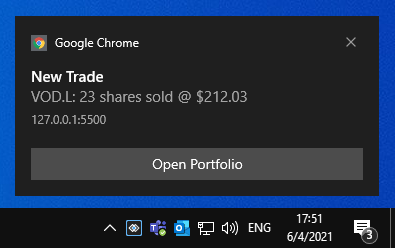
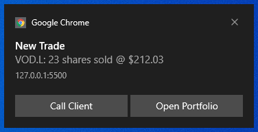

## Raising Notifications

The Notifications API is accessible through the [`glue.notifications`](../../../reference/core/latest/notifications/index.html) object.

To raise a notification from your application, use the [`raise()`](../../../reference/core/latest/notifications/index.html#API-raise) method of the API. The method accepts as an argument a required [`RaiseOptions`](../../../reference/core/latest/notifications/index.html#RaiseOptions) object with settings for the notification you want to raise:

```javascript
const options = {
    title: "New Trade",
    body: "VOD.L: 23 shares sold @ $212.03",
    actions: [
        {
            action: "openClientPortfolio",
            title: "Open Portfolio"
        }
    ]
};

// Raising a notification.
const notification = await glue.notifications.raise(options);
```

*To be able to raise notifications with actions, your [Main app](../../../developers/core-concepts/web-platform/overview/index.html) must register a Service Worker. For more details, see the [Setup](../setup/index.html#configuration) section.*



### Notification Options

The [`RaiseOptions`](../../../reference/core/latest/notifications/index.html#RaiseOptions) object extends the standard web [`NotificationDefinition`](../../../reference/core/latest/notifications/index.html#NotificationDefinition) object with three additional properties - `actions`, `title` and `clickInterop`.

| Property | Description |
|----------|-------------|
| `actions` | An array of [`NotificationAction`](../../../reference/core/latest/notifications/index.html#NotificationAction) objects. |
| `title` | The title of the notification. |
| `clickInterop` | Accepts an [`InteropActionSettings`](../../../reference/core/latest/notifications/index.html#InteropActionSettings) object as a value. Use this property to [invoke an Interop method](../../data-sharing-between-apps/interop/index.html#method_invocation) when the user clicks on the notification. You can specify arguments for the method and an [Interop target](../../data-sharing-between-apps/interop/index.html#method_invocation-targeting). |

## Notification Click

### Standard Click Handler

The `raise()` method returns a [`Notification`](../../../reference/core/latest/notifications/index.html#Notification) object. Use its `onshow` and `onclick` properties to specify callbacks that will be invoked respectively when the notification is shown or when the user clicks on the notification:

```javascript
const options = {
    title: "New Trade",
    body: "VOD.L: 23 shares sold @ $212.03",
    actions: [
        {
            action: "openClientPortfolio",
            title: "Open Portfolio"
        }
    ]
};

const notification = await glue.notifications.raise(options);

notification.onshow = () => console.log("Notification was shown.");
notification.onclick = () => console.log("Notification was clicked.");
```

### Interop Click Handler

You can also use the `clickInterop` property of the [`RaiseOptions`](../../../reference/core/latest/notifications/index.html#RaiseOptions) object to specify an Interop method that will be invoked when the user clicks on the notification. For instance, when another application has [registered an Interop method](../../data-sharing-between-apps/interop/index.html#method_registration):

```javascript
const methodName = "HandleNotificationClick";
const handler = (args) => {
    console.log(JSON.stringify(args));
};

await glue.interop.register(methodName, handler);
```

To invoke this Interop method for handling the notification click, define an [`InteropActionSettings`](../../../reference/core/latest/notifications/index.html#InteropActionSettings) object and assign it as a value to the `clickInterop` property of the notification options object:

```javascript
const interopSettings = {
    // The only required property is the method name.
    method: "HandleNotificationClick",
    arguments: {
        name: "Vernon Mullen",
        id: "1"
    }
};

const options = {
    title: "New Trade",
    body: "VOD.L: 23 shares sold @ $212.03",
    actions: [
        {
            action: "openClientPortfolio",
            title: "Open Portfolio"
        }
    ],
    clickInterop: interopSettings
};

const notification = await glue.notifications.raise(options);
```

## Notification Actions

You can create action buttons for the notification. When the user clicks on an action button, the specified callbacks will be invoked. 



To define action buttons, use the `actions` property of the [`RaiseOptions`](../../../reference/core/latest/notifications/index.html#RaiseOptions) object when creating a notification. The `actions` property accepts an array of [`InteropActionSettings`](../../../reference/core/latest/notifications/index.html#InteropActionSettings) objects:

```javascript
const options = {
    title: "New Trade",
    body: "VOD.L: 23 shares sold @ $212.03",
    actions: [
        {
            action: "callClient",
            title: "Call Client"
        },
        {
            action: "openClientPortfolio",
            title: "Open Portfolio"
        }
    ]
};
```

*Note that the action buttons in a Glue42 Notification are limited to two, as the web browsers currently support a maximum of two actions.*

See below how to create standard notification actions (actions that don't require Interop functionality) as well as Interop actions.

### Interop Actions

The [`NotificationAction`](../../../reference/core/latest/notifications/index.html#NotificationAction) object provides an `interop` property which you can use to [invoke Interop methods](../../data-sharing-between-apps/interop/index.html#method_invocation) when the user clicks an action button in the notification.

First, [register an Interop method](../../data-sharing-between-apps/interop/index.html#method_registration) from another application:

```javascript
const methodName = "HandleNotificationClick";
const handler = (args) => {
    console.log(JSON.stringify(args));
};

await glue.interop.register(methodName, handler);
```

After that, in your app define an [`InteropActionSettings`](../../../reference/core/latest/notifications/index.html#InteropActionSettings) object and assign it as a value to the `interop` property of the action object in the `actions` array:

```javascript
const interopSettings = {
    // The only required property is the method name.
    method: "HandleNotificationClick",
    arguments: {
        name: "Vernon Mullen",
        id: "1"
    }
};

const notificationOptions = {
    title: "New Trade",
    body: "VOD.L: 23 shares sold @ $212.03",
    actions: [
        {
            action: "openClientPortfolio",
            title: "Open Portfolio",
            interop: interopSettings
        }
    ]
};

const notification = await glue.notifications.raise(notificationOptions);
```

## Default Notification Handlers

In each [**Glue42 Core**](https://glue42.com/core/) [Web Client](../../../developers/core-concepts/web-client/overview/index.html) app (including the [Main app](../../../developers/core-concepts/web-platform/overview/index.html)) you can define default handlers for notification and action clicks. The appropriate handlers will be called when the notification or the action is clicked. Use the `notification` property of the configuration object for the [Glue42 Web](https://www.npmjs.com/package/@glue42/web) library to specify default notification handlers.

Web Client apps:

```javascript
const config = {
    notifications: {
        defaultClick: (glue, notificationDefinition) => console.log("The notification was clicked."),
        actionClicks: [
            {
                action: "openClientPortfolio",
                handler: (glue, notificationDefinition) => console.log("A notification action was clicked.")
            }
        ]
    }
};

const glue = await GlueWeb(config);
```

Main app:

```javascript
const config = {
    glue: {
        notifications: {
            defaultClick: (glue, notificationDefinition) => console.log("The notification was clicked."),
            actionClicks: [
                {
                    action: "openClientPortfolio",
                    handler: (glue, notificationDefinition) => console.log("A notification action was clicked.")
                }
            ]
        }
    }
};

const { glue } = await GlueWebPlatform(config);
```

## Requesting permission

An often neglected UX element is the notification permission request. Usually websites ask for notifications permission as soon as the user lands on the site which in most cases leads to a rejection by the user, because they don't know whether they'll be interested in receiving notifications from the site. Generally, users avoid notifications if they aren't absolutely sure they want to receive them. To make matters worse, once a user declines the request, undoing the rejection becomes complicated as it can't be done programmatically and requires the user to manually find the relevant browser setting, find the site in question and unblock it from sending notifications.

This is the reason why [**Glue42 Core**](https://glue42.com/core/) won't request a permission on startup. A permission will be requested when a [`raise()`](../../../reference/core/latest/notifications/index.html#API-raise) call is made or when the dedicated [`requestPermission()`](../../../reference/core/latest/notifications/index.html#API-requestPermission) method is used:

```javascript
// Returns a boolean value.
const hasPermission = await glue.notifications.requestPermission();
```

## Reference

[Notifications API Reference](../../../reference/core/latest/notifications/index.html)