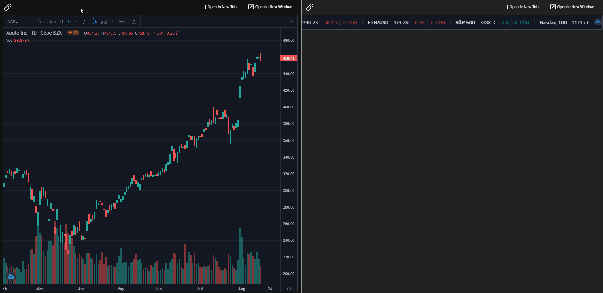

## Overview

[FDC3](https://fdc3.finos.org/) aims at developing specific protocols and classifications in order to advance the ability of desktop applications in financial workflows to interoperate in a plug-and-play fashion without prior bilateral agreements.

## FDC3 for Glue42 Core

This guide explains how to run an FDC3 compliant app in a [**Glue42 Core**](https://glue42.com/core/) project. For detailed information on the FDC3 API itself, see the [FDC3 documentation](https://fdc3.finos.org/docs/next/api/overview).

### Initialization

The [`@glue42/fdc3`](https://www.npmjs.com/package/@glue42/fdc3) library is the Glue42 implementation of the FDC3 standards. Reference it in your application:

```html
<script src="https://unpkg.com/@glue42/fdc3@latest/dist/fdc3-glue42.js"></script>
```

The Glue42 FDC3 library determines internally the environment it runs in ([**Glue42 Core**](https://glue42.com/core/) or [**Glue42 Enterprise**](https://glue42.com/enterprise/)) and initializes the correct Glue42 library. In a [**Glue42 Core**](https://glue42.com/core/) project that can be either [`@glue42/web-platform`](https://www.npmjs.com/package/@glue42/web-platform) or [`@glue42/web`](https://www.npmjs.com/package/@glue42/web) depending on whether your application is a [Main application](../../developers/core-concepts/web-platform/overview/index.html) or [a Web Client](../../developers/core-concepts/web-client/overview/index.html). You don't need to call the `GlueWeb()`/`GlueWebPlatform()` factory functions. The FDC3 API entry point `fdc3` is available as a property of the global `window` object:

```javascript
fdc3.addContextListener(context => console.log(`Context: ${context}.`));
```

To provide configuration for an FDC3 [Main application](../../developers/core-concepts/web-platform/overview/index.html), attach a `webPlatformConfig` config object to the global `window` object before referencing [`@glue42/fdc3`](https://www.npmjs.com/package/@glue42/fdc3):

```html
<script>
    window.webPlatformConfig = {
        applications: {
            local: [
                ...
            ]
        },
        channels: {
            definitions: [
                ...
            ]
        }
    };
</script>
<script src="https://unpkg.com/@glue42/fdc3@latest/dist/fdc3-glue42.js"></script>
```

*Note that the configuration object must be named `webPlatformConfig`.*

See below how to use the different FDC3 features.

### Intents

The [FDC3 Intents](https://fdc3.finos.org/docs/next/intents/overview) concept enables the creation of cross-application workflows on the desktop. An application declares an Intent through configuration. An Intent specifies what action the application can execute and what data structure it can work with.

To define an Intent, add it to the application definition object in the configuration of the [Main application](../../developers/core-concepts/web-platform/setup/index.html#configuration) or in the application definitions provided by a remote source. For more details on defining applications, see the [Application Management: Application Definitions](../../capabilities/application-management/index.html#application_definitions) section. Intents can be configured under the `intents` top-level key of the application definition:

```html
<script>
    window.webPlatformConfig = {
        applications: {
            local: [
                {
                    name: "Clients",
                    details: {
                        url: "http://localhost:4242/clients"
                    },
                    // Intent definitions.
                    intents: [
                        {
                            name: "ShowClientInfo",
                            displayName: "Client Info",
                            contexts: [
                                "ClientName"
                            ]
                        }
                    ]
                }
            ]
        }
    };
</script>
<script src="https://unpkg.com/@glue42/fdc3@latest/dist/fdc3-glue42.js"></script>
```

| Property | Description |
|----------|-------------|
| `name` | **Required**. The name of the Intent. |
| `displayName` | The human readable name of the Intent. Can be used in context menus, etc., to visualize the Intent. |
| `contexts` | The type of predefined data structures with which the application can work (see [FDC3 Contexts](https://fdc3.finos.org/docs/next/context/overview)). |

*For more information on using Intents, see the [FDC3 Intents API](https://fdc3.finos.org/docs/next/intents/overview).*

### Channels

An [FDC3 Channel](https://fdc3.finos.org/docs/next/api/ref/Channel) is a named context object that an application can join in order to share and update context data and also be alerted when the context data changes. By [specification](https://fdc3.finos.org/docs/next/api/spec#context-channels), Channels can either be well-known system Channels or Channels created by apps. On a UI level, Channels can be represented by colors and names.

To define Channels, use the [Main application](../../developers/core-concepts/web-platform/setup/index.html#configuration) configuration:

```html
<script>
    window.webPlatformConfig = {
        channels: {
            // Channel definitions.
            definitions: [
                {
                    name: "Red",
                    meta: {
                        color: "red"
                    },
                    data: { glue: 42 }
                },
                {
                    name: "Green",
                    meta: {
                        color: "#008000"
                    }
                }
            ]
        }
    };
</script>
<script src="https://unpkg.com/@glue42/fdc3@latest/dist/fdc3-glue42.js"></script>
```

All Glue42 Channels are available as FDC3 system Channels.

[**Glue42 Core**](https://glue42.com/core/) applications can interact with FDC3 Channels by using the [Shared Contexts API](../../capabilities/data-sharing-between-apps/shared-contexts/index.html). For each FDC3 Channel there is a shared context with the same name. Use the `get()`, `set()`, `update()` and `subscribe()` methods to interact with it.

*For a sample Channel Selector widget implementation, see the [Channels: Channel Selector UI](../../capabilities/data-sharing-between-apps/channels/index.html#channel_selector_ui) section, which offers example implementations for the most popular JavaScript frameworks. Note that internally the examples use the [**Glue42 Core**](https://glue42.com/core/) Channels API and not the FDC3 Channels API.*

*For more information on using Channels, see the [FDC3 Channels API](https://fdc3.finos.org/docs/next/api/ref/Channel).*

### App Directory

The goal of the [FDC3 App Directory](https://fdc3.finos.org/docs/next/app-directory/overview) REST service is to provide trusted identity for desktop apps. Application definitions are provided by one or more App Directory REST services where user entitlements and security can also be handled.

To connect to a remote source of application definitions, attach a `remoteSources` configuration object to the global `window` object before referencing [`@glue42/fdc3`](https://www.npmjs.com/package/@glue42/fdc3):

```html
<script>
    window.remoteSources = [
        {
            url: "http://localhost:3001/v1/apps/search",
            pollingInterval: 1000,
            requestTimeout: 5000
        }
    ];
</script>
<script src="https://unpkg.com/@glue42/fdc3@latest/dist/fdc3-glue42.js"></script>
```

*Note that the configuration object must be named `remoteSources`.*

| Property | Description |
|----------|-------------|
| `url` | **Required**. The URL of the remote source of application definitions. The remote source must follow the [FDC3 App Directory standard](https://github.com/finos/FDC3). The provided applications must be of type `Glue42WebApplicationDefinition` or `FDC3Definition`. |
| `pollingInterval` | The polling interval for fetching application definitions from the remote source in milliseconds. Defaults to 3000. |
| `requestTimeout` | The request timeout for fetching application definitions from the remote source in milliseconds. Defaults to 3000. |


*Note that any application can connect to remote sources and not only the Main application. The application definitions from all remote sources are then merged by the Main application. The remote sources can supply both [**Glue42 Core**](https://glue42.com/core/) and FDC3 application definitions. [**Glue42 Core**](https://glue42.com/core/) supports both. The only requirement for an FDC3 application definition to be usable in [**Glue42 Core**](https://glue42.com/core/) is to have a valid `details.url` or a `url` top-level property in its `manifest` JSON string property.*

Alternatively, you can supply the application definitions locally to the Main application using the `webPlatformConfig.applications.local` property.

Below is an example of an FDC3 application definition:

```json
{
    "name": "Clients",
    "appId": "clients",
    "manifestType": "Glue42",
    "manifest": "{\"details\":{\"url\":\"http://localhost:4242/clients\"}}",
    "intents": [
        {
            "name": "ShowClientInfo",
            "displayName": "Client Info",
            "contexts": [
                "ClientName"
            ]
        }
    ]
}
```

*For more information on using App Directory, see the [FDC3 App Directory documentation](https://fdc3.finos.org/docs/next/app-directory/overview).*

### Demo

Example of the `broadcast()`, `addContextListener()`, `findIntentsByContext()` and `raiseIntent()` API calls implemented by `@glue42/fdc3` are available in [this demo](https://fdc3-demo.glue42.com).

The demo consists of a Chart and a Blotter application. Searching and selecting a ticker in the Chart application adds it to the Blotter application as long as the two applications are on the same Channel (use the Channel Selector widget to navigate between Channels):



Right-clicking on an instrument in the Blotter opens a context menu with the Intents that can be raised for the instrument. If the Chart application is running, it will update its context, and if there are no instances of the Chart application running, a new instance with the given context will be started.

Use the [code of the demo](https://github.com/Glue42/fdc3-demos/tree/adapt-for-glue42) as a reference when adapting your own applications.

#### Extension

The demo project also contains a Chrome extension that auto injects `@glue42/fdc3` in all web pages. It spares you the need to reference the library in all your projects and redeploy them or when integrating with 3rd party closed source applications.

To install the extension, follow the instructions in the [README](https://github.com/Glue42/fdc3-demos/blob/adapt-for-glue42/README.md) file.